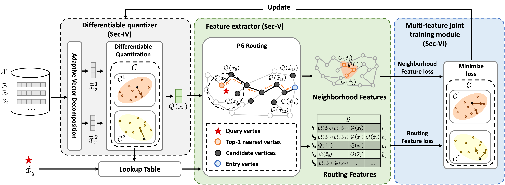

# RPQ:Routing-Guided Learned Product Quantization for Graph-Based Approximate Nearest Neighbor Search

## Quick Links

* [Quick Tour](#quick-tour)

* [Baseline](#baseline)

* [Datasets](#datasets)

* [Installation](#installation)

## Quick Tour

Given a vector dataset $\mathcal{X}$, a query vector $\vec{x}_q$, graph-based Approximate Nearest Neighbor Search (ANNS) aims to build a proximity graph (PG) as an index of $\mathcal{X}$ and approximately return vectors with minimum distances to $\vec{x}_q$ by searching over the PG index. It has been widely recognized that graph-based ANNS is effective and efficiency, however, it suffers from the large-scale $\mathcal{X}$ because of the entire PG is too large to fit into the memory, e.g., a billion-scale dataset would cause more than 75 GB memory for a PG index. To solve this, Product Quantization (PQ) integrated graph-based ANNS is proposed to reduce the memory usage, by replacing a large PG with original vectors by the one with smaller compact codes of quantized vectors. Existing PQ methods do not consider the important routing features of PG, thus resulting in low-quality quantized vectors that significantly affect the ANNS's effectiveness. We present a general Routing-guided leaned Product Quantization (RPQ) for graph-based ANNS, which easily can be adaptive to existing popular PGs. Specifically, RPQ consists of (1) a differentiable quantizer used to make the standard discrete PQ differentiable to suit for back-propagation of end-to-end learning, (2) a sampling-based feature extractor used to extract neighborhood and routing features of a PG by using the quantized vectors, and (3) a multi-feature joint training module with two types of feature-aware losses to continuously optimize the the differentiable quantizer. As a result, the inherent features of a specific PG would be embedded into the learned PQ, thus generating high-quality quantized vectors that facilitate the graph-based ANNS's effectiveness. Moreover, we integrate our RPQ with existing PGs and the state-of-the-art DiskANN to improve their effectiveness for large-scale datasets. Comprehensive experimental studies on real-world datasets demonstrate RPQ's superiority.

## Baseline

* Product Quantization (PQ) : PQ [[TPAMI'11](https://ieeexplore.ieee.org/abstract/document/5432202)] is a typical quantization algorithm that is widely used in large billion-scale indices [[NeurIPS'19](https://proceedings.neurips.cc/paper_files/paper/2019/hash/09853c7fb1d3f8ee67a61b6bf4a7f8e6-Abstract.html),[ECCV'18](https://openaccess.thecvf.com/content_ECCV_2018/html/Dmitry_Baranchuk_Revisiting_the_Inverted_ECCV_2018_paper.html)]. 

* Optimized Product Quantization (OPQ) : OPQ [[TPAMI'14](https://ieeexplore.ieee.org/abstract/document/6678503)] allows jointly optimizes bit allocation and reconstruction error.

* Link\&Code : Link\&Code[[CVPR'18](https://openaccess.thecvf.com/content_cvpr_2018/html/Douze_Link_and_Code_CVPR_2018_paper.html)] design a new PQ-based method specifically for HNSW.

* Catalyst : Catalyst[[ICLR'19](https://arxiv.org/abs/1806.03198)]utilize a compression network optimize quantization for similarity search, and DIM-RED [[ICML'20](http://proceedings.mlr.press/v119/prokhorenkova20a.html)] combine this method with graph-based ANNS methods.

## Datasets

| Dataset                                                      | # Dimension | # Base     | # Query | # Train       |
| ------------------------------------------------------------ | ----------- | ---------- | ------- | ------------- |
| BIGANN ([link](http://corpus-texmex.irisa.fr/))              | 128         | 1,000,000  | 100,000 | 500,000       |
| DEEP   ([link](https://research.yandex.com/blog/benchmarks-for-billion-scale-similarity-search)) | 96         | 1,000,000     | 100,000  | 500,000   | 
| GIST   ([link](http://corpus-texmex.irisa.fr/)))             | 960         | 1,000,000  | 10,000  | 500,000       |
| UKBENCH([link](https://archive.org/details/ukbench))         | 128         | 1,000,000  | 200     | 97,907        |
| SIFT   ([link](http://corpus-texmex.irisa.fr/))              | 128         | 1,000,000  | 10,000  | 100,000       |

## Installation

